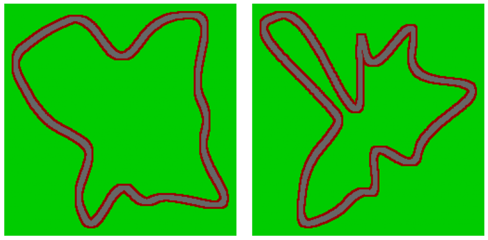
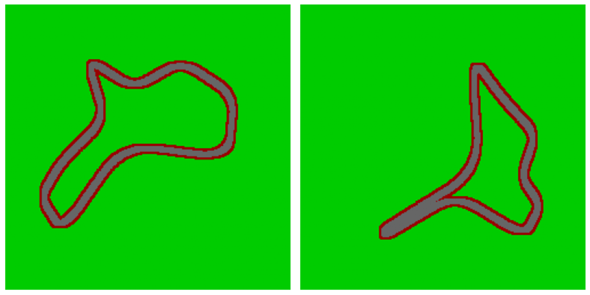
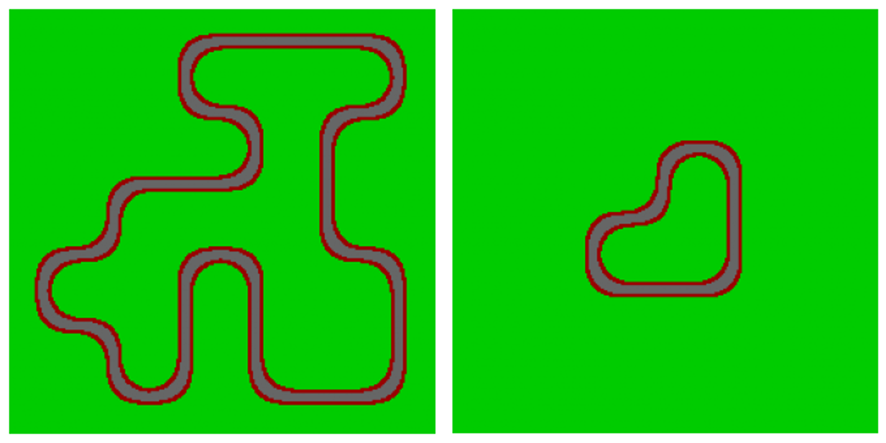

# Automatic-racetrack-generation
This is the first step of a general project on devlopping genetic algorithm to train neural network to drive a car.

The code folder countain the following python files:

- CircleMethod.py:
    - MakeBroke_circleCircuit: Function to creat a random racetrack from a circle.
 
- ConvexeMethod.py:
    - JarvisWalk: Function to fin the convex envelope of the random cloud.
    - ComplexIt: Function to break the line witch length is superior to mind.
    - MakeHullCircuit: Function to create random racetrack from the convex envelope of a random	cloud of dots.

- ExplorationMethod.py:
    - SelectCroix: Function to select 4 values on a 2d np.array with a specific structure.
    - Polyg: Function to cut a polygon into a 2d np.array.
    - Polygonize: Function to find the differents poylgons on a 2d np.array created by	groups of cells of same values.
    - Exploration: Function to create the base of the racetrack.
    - MakeExplorerCircuit: Function to create a random racetrack by the exploration of a np.ndarray of shape: Shape.

- generals.py:
    - VectorialSmooth: Function to smooth an 1d numpy.array.
    - SmoothCircuit: Function to smooth the path of the road to remoove the angular cut.

- construct.py:
    Contruction file.

There are three method to create racetrack that will have differents poperty:
  - MakeBroke_circleCircuit:
      These racetraks will be caracterises by many turns including several
      series. They will also often be longer than those generated by the
      other two methods. They will also include long straight lines. Finally
      there are (depending to the noise level add by the user) low risk for
      them to have artifact.
      
      Here are exemples of racetracks produced with this function. The one
      on the right have a small artifact at the center of the upper part.
      

  - MakeHullCircuit:
      These racetraks will be caracterises by some turns. Most of them are
      gentle and the other will bee quite sharp. They rarely have a long
      straight line and most often have a general convex shape. This come
      from there method of creation. These racetraks will also generally be
      shorter than those constructed by "MakeBroke_circleCircuit". Finally,
      there are (depending to the noise level add by the user) medium risk
      for them to have artifact(s).
      
      Here are exemples of racetracks produced with this function. The one
      on the right have a huge artifact at the right part.
      
 
  - MakeExplorerCircuit:
      These racetraks will be caracterises by many turns and many small
      straigth lines. They can have many very differents shape and length.
      The racetraks constructed this way looks very little like those
      produced by the other methods. There should not produce any artifact(s).
      
      Here are exemples of racetracks produced with this function. None of
      them have any artifact, but we can see that the one at the right is
      significantly smaller tha the one at the left.
      

