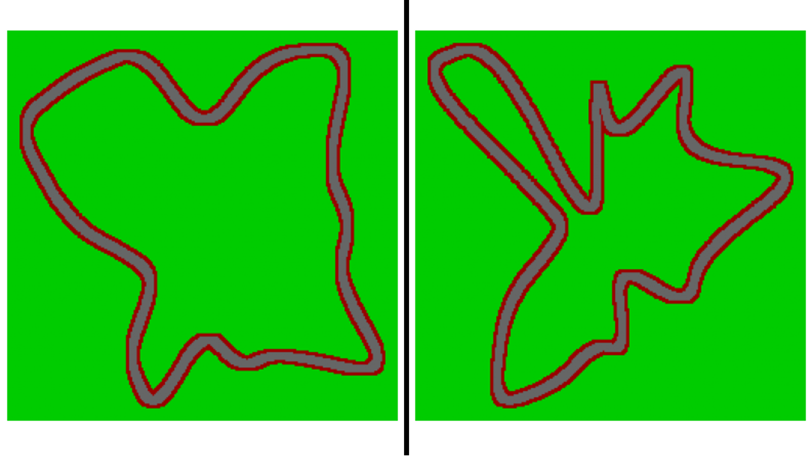
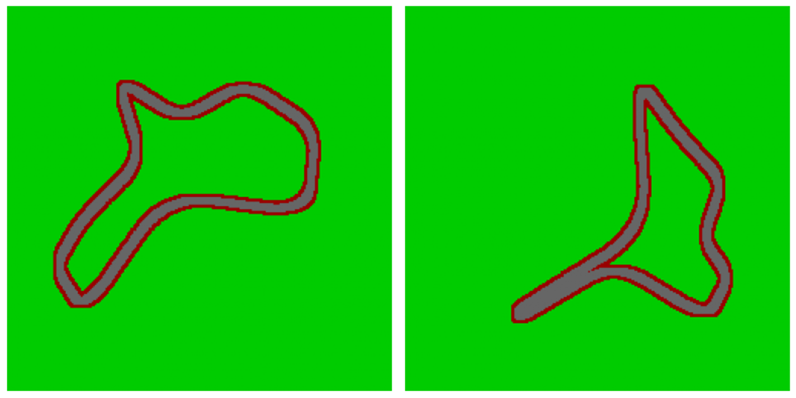
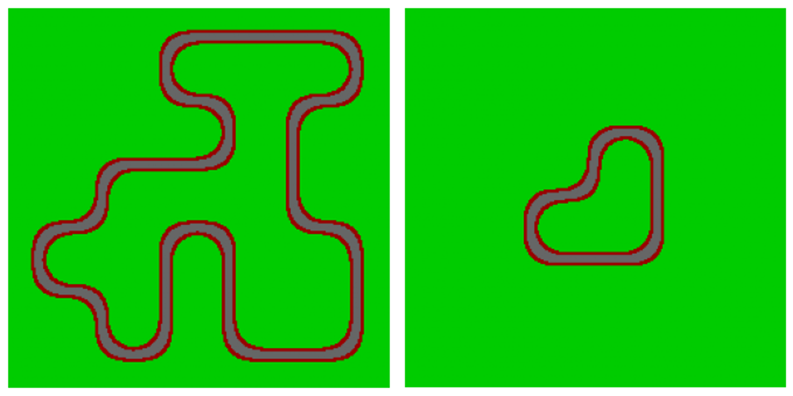

# Automatic-racetrack-generation
This is the first step of a general project on devlopping genetic algorithm to train neural network to drive a car.

The code folder countain the following python files:

- CircleMethod.py:
    - MakeBroke_circleCircuit: Function to creat a random racetrack from a circle.
 
- ConvexeMethod.py:
    - JarvisWalk: Function to fin the convex envelope of the random cloud.
    - ComplexIt: Function to break the line witch length is superior to mind.
    - MakeHullCircuit: Function to create random racetrack from the convex envelope of a random	cloud of dots.

- ExplorationMethod.py:
    - SelectCroix: Function to select 4 values on a 2d np.array with a specific structure.
    - Polyg: Function to cut a polygon into a 2d np.array.
    - Polygonize: Function to find the differents poylgons on a 2d np.array created by	groups of cells of same values.
    - Exploration: Function to create the base of the racetrack.
    - MakeExplorerCircuit: Function to create a random racetrack by the exploration of a np.ndarray of shape: Shape.

- generals.py:
    - VectorialSmooth: Function to smooth an 1d numpy.array.
    - SmoothCircuit: Function to smooth the path of the road to remoove the angular cut.

- construct.py:
    Contruction file.

There are three method to create racetrack that will have differents poperty:
    - MakeBroke_circleCircuit:
        These racetraks will be caracterises by many turns including several
        series. They will also often be longer than those generated by the
        other two methods. They will also include long straight lines. Finally
        there are (depending to the noise level add by the user) low risk for
        them to have artifact.
        

    - MakeHullCircuit:
        These racetraks will be caracterises by some turns
        
 
    - MakeExplorerCircuit:
        These racetraks will be caracterises by many turns
        

